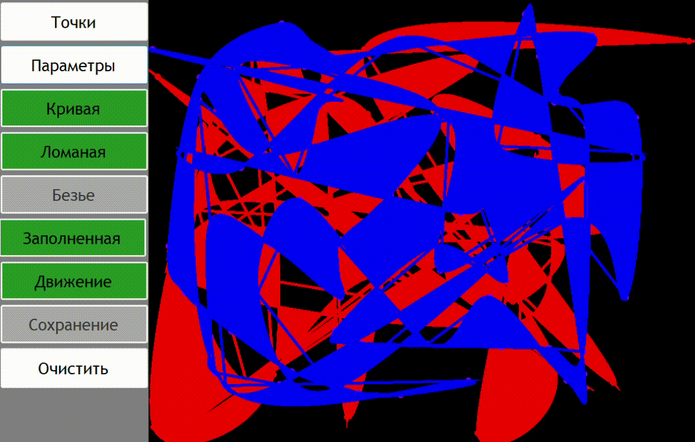

# 2D Graphics WinForms Application

This is an application that allows you to create points on a canvas and connect 
them with a variety of line types. You can also easily adjust the color and thickness
of the lines, fill the space between them and move points in different directions,
that creates the perfect and absolutely astonishing graphics.





## Building and Running the Application

To build the application, clone this repository with command 
```shell
git clone https://github.com/AdamRashi/2dGraphics.git
```
or simply download the .zip file from this page.

Open the solution file in Visual Studio and click the "Build" button. 
To run the application, click the "Start" button in Visual Studio or 
navigate to the `bin/Debug` folder and double-click the executable.

## Usage 

 GUI of the application is relatively simple and has the russian localization, 
 therefore I'll explain only some of not so obvious features:

- by clicking on a point and moving the mouse you can change the position of the point 
- by clicking ```ESC``` key you can clean the canvas
- by clicking ```SPACE``` tab you can make points move and stop
- to shift the currently editing figure, use ```↓, →, ←, ↑``` keys
- in a moving mode, press ```+``` or ```-``` keys to adjust the speed of movement


## Dependencies

This application requires the .NET Framework version 4.5 or higher to run. If you do not have the .NET Framework installed, you can download it from the Microsoft website.


## Next features

- drawing a line with a mouse right click
- adding buffer for erasing only last figure at a time

## Contact

If you have any questions or issues with this application, please contact me, ```Adam Rashi``` at ```adamrashi@mail.ru```
